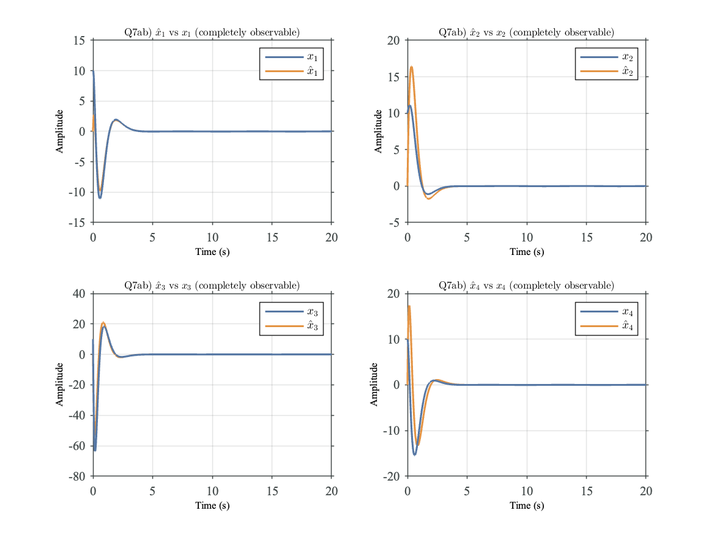

# MATLAB_Defaults

## Instructions
Clone this repository, then add it to MATLAB file path. First click 'set path' on the top of the window, then add with subfolders:

## Additional Simulink Scope Utilities
Run on MATLAB R2022 only. (possibly newer)
Utility to export SIMULINK Scopes to PDF. 

SIMULINK instructions Steps:
1) Save simulink scopes using 'Print to Figure' to a .fig file
2) CONV_ALL_FIG_TO_PDF('EXP/') converts all .fig files to .pdf within the folder EXP/ (relative)

Changes from the original version
Changed font colours to match Tableau 10. changed default fontto times new roman.

Start by reading GENERAL_INSTRUCTIONS.txt, and copy pasting my examples.

## Example Plots

## Citation
https://doi.org/10.5281/zenodo.7439954
